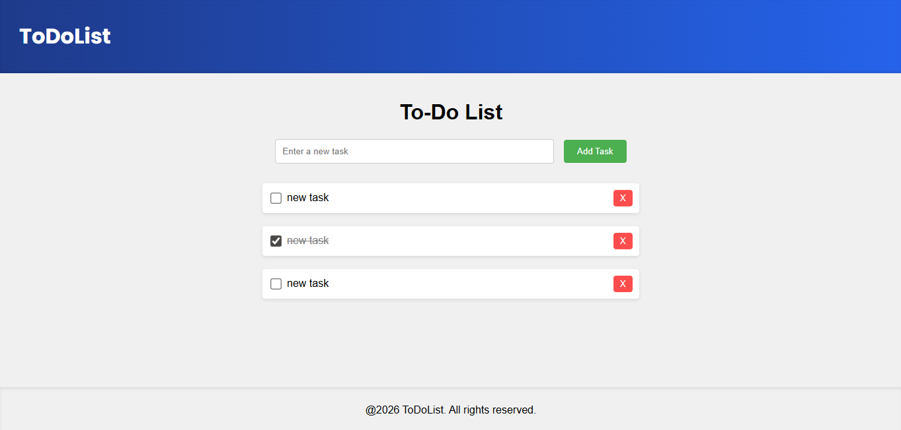

# ToDoList App

A simple and interactive To-Do List application built with **JavaScript, HTML, and CSS**.
This project allows users to manage daily tasks with persistence using **LocalStorage**.

---

## Features

* Add new tasks
* Mark tasks as completed
* Delete tasks
* Automatic saving with LocalStorage
* Tasks persist after page reload

---

## Technologies Used

* HTML5
* CSS3
* JavaScript (Vanilla JS)
* Browser LocalStorage API

---

## Preview



---

## Project Structure

```
toDoList-Frontend/
│
├── index.html
├── style.css
└── script.js
```

---

## How It Works

The application uses the browser's **LocalStorage** to store tasks.

* Tasks are saved as a JSON string using `JSON.stringify()`
* When the page loads, tasks are retrieved using `JSON.parse()`
* Each task contains:

  * `text`: the task description
  * `completed`: boolean indicating status

---

## Getting Started

1. Clone this repository:

```
git clone https://github.com/crenofor/ToDoList-Frontend
```

2. Open the project folder

3. Run the app:

* Open `index.html` in your browser

---

## Author

Developed by **Rafael Lopes**

---